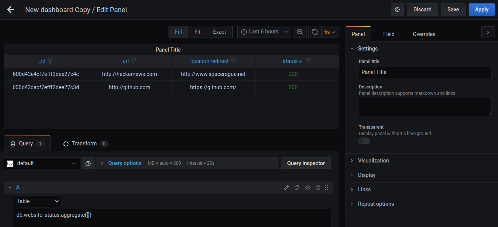
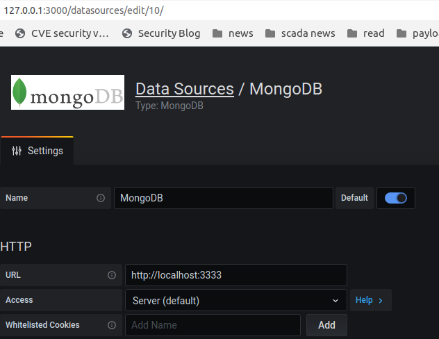
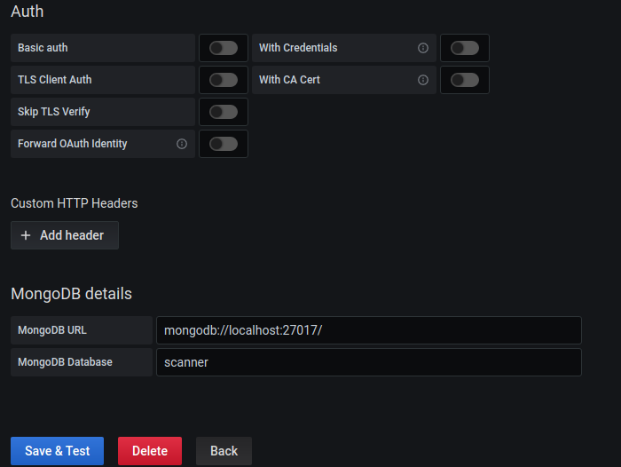

# Passive Scanner
passive scanner and save to database

# Gafana
### Run grafana-server 

```
sudo systemctl start grafana-server
```




```
db.passive_scanner.aggregate([])
```


# MongoDB datasource for Grafana
The [GitHUB](https://github.com/JamesOsgood/mongodb-grafana/) project has been used to connect Grafana and Mongo

## Features
Allows MongoDB to be used as a data source for Grafana by providing a proxy to convert the Grafana Data source [API](http://docs.grafana.org/plugins/developing/datasources/) into MongoDB aggregation queries

## Requirements

* **Grafana** > 3.x.x
* **MongoDB** > 3.4.x

## Installation

### Install the Grafana plugin components

* Copy the whole mongodb-grafana dir into the Grafana plugins dir ( /usr/share/grafana/plugins-bundled/mongodb-grafana )
* Restart the Grafana server. If installed via Homebrew, this will be `brew services restart grafana`

### Install and Start the MongoDB proxy server

* Open a command prompt in the mongodb-grafana directory
* Run `npm install` to install the node.js dependencies
* Run `npm run server` to start the REST API proxy to MongoDB. By default, the server listens on http://localhost:3333

## Examples

Create a new data source of type MongoDB as shown below. The MongoDB details are :

* **MongoDB URL** - `mongodb://localhost:27017/`
* **MongoDB Database** - `scanner`






# Mongo
MongoDB is a free and open-source cross-platform document-oriented database program. Classified as a NoSQL database program, MongoDB uses JSON-like documents with schemata. MongoDB is developed by MongoDB Inc., and is published under a combination of the Server Side Public License and the Apache License.

## How to use this image


### Run mongodb with docker
```
docker run --rm -it --name mongodb -v ~/w/docker-db/datadir:/data/db -p 27017:27017 mongo
```


### Run postgresql with docker(not work)
```
docker run --rm -it --name postgres -p 5432:5432 -v ~/w/docker-db/datadir:/var/lib/postgresql/data -e POSTGRES_PASSWORD=postgres -d postgres
```

```
user:postgres
pass:postgres
```
